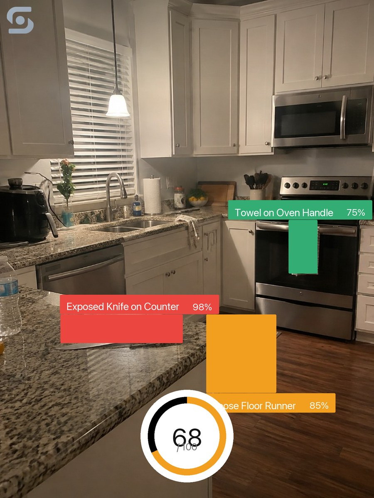
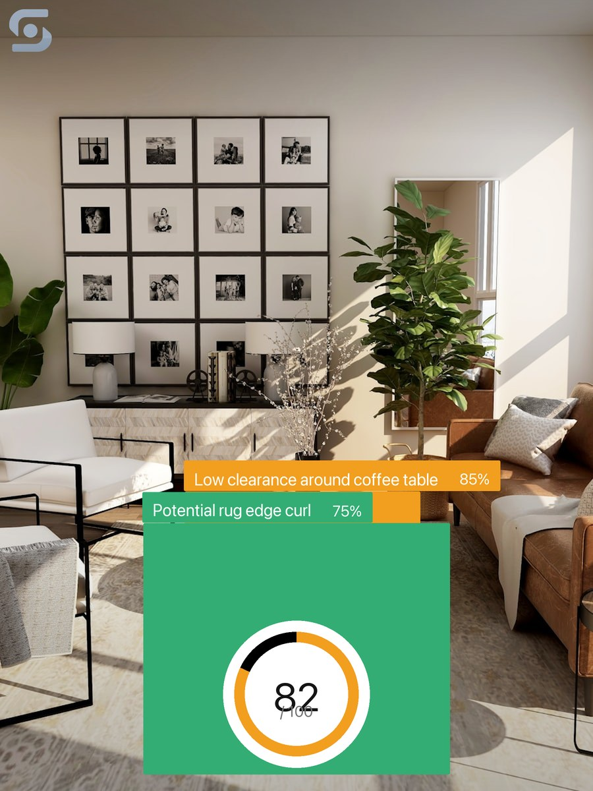

  

  <strong>Point your camera at a room. Safesight finds visible risks and tells you what to fix.</strong>

  
  
  
  
  

---

## Demo

https://github.com/user-attachments/assets/f64f8f53-fefa-4e8b-b71f-d148672f56f8

---

## AI proof

Live hosted scans against `https://safesight.noahwhiteson.com` — **3/3 passed** on `gemini-3.8-flash` (~3s each). Share cards use the same export chrome as the iOS app (`ScanShareExporter`).

| Scene | Latency | House Score | Hazards |
|-------|---------|-------------|---------|
| Kitchen | 3.1s | 68 | 3 |
| Hallway | 3.8s | 82 | 2 |
| Kitchen (stock) | 3.0s | 85 | 2 |

  
  &nbsp;
  

  Kitchen · 68/100 &nbsp;·&nbsp; Hallway · 82/100

Full tables, raw JSON, and how to re-run: **[docs/benchmark](docs/benchmark/README.md)**

---

## Table of contents

1. [Setup / run](./docs/setup.md)
2. [What is Safesight?](./docs/what-is-safesight.md)
3. [The problem](./docs/the-problem.md)
4. [What the app does](./docs/what-the-app-does.md)
5. [How it works](./docs/how-it-works.md)
6. [What’s inside the experience](./docs/experience.md)
7. [Design principles](./docs/design-principles.md)
8. [Tech at a glance](./docs/tech.md)
9. [FAQ](./docs/faq.md)
10. [Shipaton Next Gen](./docs/shipaton-next-gen.md)
11. [Safesight in real rooms](./docs/real-scans.md)
12. [AI benchmark](./docs/benchmark/README.md)
13. [Terms of Service](./docs/terms-of-service.md)
14. [Privacy Policy](./docs/privacy-policy.md)
15. [Disclaimer & license](./docs/disclaimer-and-license.md)

---

**Safesight** turns one room photo into labeled hazards, a House Score, and a path to fix — built for [Shipaton 2026 Next Gen](docs/shipaton-next-gen.md) with RevenueCat Premium.

  Built with SwiftUI · Gemini · RevenueCat · for Shipaton Next Gen

