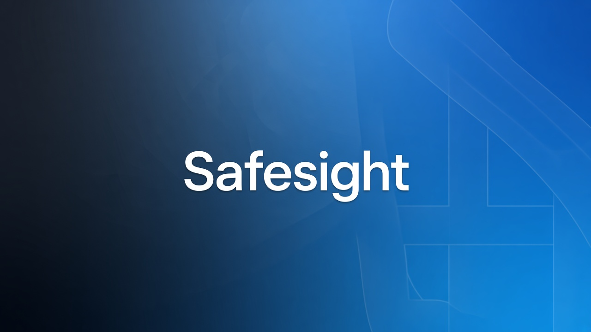

  

  <strong>Point your camera at a room. Safesight finds visible risks and tells you what to fix.</strong>

  
  
  
  
  

---

## Table of contents

1. [What is Safesight?](./docs/what-is-safesight.md)
2. [The problem](./docs/the-problem.md)
3. [What the app does](./docs/what-the-app-does.md)
4. [How it works](./docs/how-it-works.md)
5. [What’s inside the experience](./docs/experience.md)
6. [Design principles](./docs/design-principles.md)
7. [Tech at a glance](./docs/tech.md)
8. [Shipaton Next Gen](./docs/shipaton-next-gen.md)
9. [Safesight in real rooms](./docs/real-scans.md)
10. [Disclaimer & license](./docs/disclaimer-and-license.md)

---

**Safesight** turns one room photo into labeled hazards, a House Score, and a path to fix — built for [Shipaton 2026 Next Gen](docs/shipaton-next-gen.md) with RevenueCat Premium.

  Built with SwiftUI · Gemini · RevenueCat · for Shipaton Next Gen

