# AI benchmark

Live proof that Safesight’s hosted vision pipeline returns real House Scores,
hazard labels, confidences, and bounding boxes — then exports via the **exact**
iOS `ScanShareExporter` (simulator CLI).

- **Ran:** `2026-09-11 02:17:04Z`
- **API:** `https://safesight.noahwhiteson.com`
- **Model:** `gemini-3.8-flash` (from `/health`)
- **Result:** **20/20 passed**

## Cases

| # | Scene | HTTP | Latency | Score | Hazards | Check |
|---|-------|------|---------|-------|---------|-------|
| 1 | ✅ Kitchen (user) | 200 | 3.68s | 68 | 4 | ok |
| 2 | ✅ Living / hallway | 200 | 3.01s | 82 | 3 | ok |
| 3 | ✅ Kitchen (stock) | 200 | 2.73s | 88 | 2 | ok |
| 4 | ✅ Kitchen mid crop | 200 | 3.25s | 78 | 2 | ok |
| 5 | ✅ Kitchen counter crop | 200 | 3.63s | 62 | 3 | ok |
| 6 | ✅ Kitchen floor crop | 200 | 2.91s | 62 | 2 | ok |
| 7 | ✅ Kitchen oven crop | 200 | 5.12s | 68 | 4 | ok |
| 8 | ✅ Kitchen island crop | 200 | 2.9s | 62 | 2 | ok |
| 9 | ✅ Living center crop | 200 | 3.62s | 82 | 3 | ok |
| 10 | ✅ Living floor crop | 200 | 5.46s | 78 | 4 | ok |
| 11 | ✅ Living left crop | 200 | 4.31s | 85 | 3 | ok |
| 12 | ✅ Living right crop | 200 | 2.34s | 88 | 1 | ok |
| 13 | ✅ Living wall crop | 200 | 2.82s | 82 | 2 | ok |
| 14 | ✅ Stock island crop | 200 | 2.12s | 92 | 1 | ok |
| 15 | ✅ Stock cookware crop | 200 | 5.73s | 78 | 3 | ok |
| 16 | ✅ Stock floor crop | 200 | 6.48s | 78 | 3 | ok |
| 17 | ✅ Stock wide crop | 200 | 3.15s | 85 | 2 | ok |
| 18 | ✅ Kitchen upper crop | 200 | 3.88s | 74 | 3 | ok |
| 19 | ✅ Living close crop | 200 | 3.62s | 68 | 4 | ok |
| 20 | ✅ Stock corner crop | 200 | 5.33s | 85 | 2 | ok |

## Share cards (native `ScanShareExporter`)

### Kitchen (user) — 68/100

> Exposed knife on the island and runner rug edges present cut and trip risks.

<p align="center">
  
</p>

| Hazard | Severity | Confidence | Focus |
|--------|----------|------------|-------|
| Unsecured Kitchen Knife | High | 96% | Sharp objects |
| Unsecured Kitchen Runner Rug | Medium | 82% | Trip hazards |
| Towel Hanging on Oven Handle | Low | 75% | Fire |
| Appliance Cord Near Sink | Medium | 78% | Kitchen hazards |

### Living / hallway — 82/100

> Living area is generally tidy but presents minor tip-over and rug trip concerns.

<p align="center">
  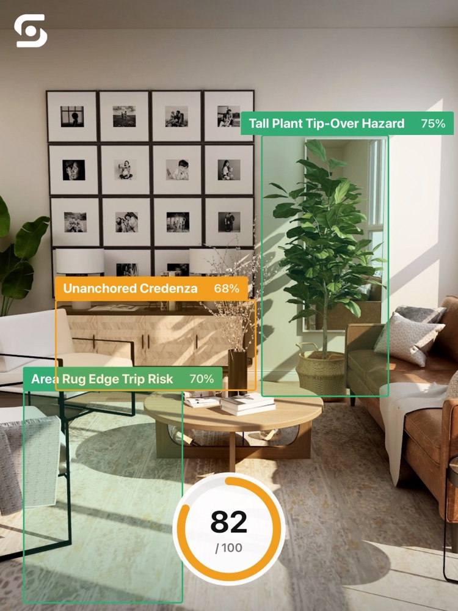
</p>

| Hazard | Severity | Confidence | Focus |
|--------|----------|------------|-------|
| Tall Plant Tip-Over Hazard | Low | 75% | Tip-over risks |
| Area Rug Edge Trip Risk | Low | 70% | Trip hazards |
| Unanchored Credenza | Medium | 68% | Tip-over risks |

### Kitchen (stock) — 88/100

> Clean kitchen space with minimal hazards, primarily pots resting near island edge.

<p align="center">
  
</p>

| Hazard | Severity | Confidence | Focus |
|--------|----------|------------|-------|
| Heavy pot near island edge | Low | 75% | Kitchen hazards |
| Loose cookware lid on counter | Low | 70% | Kitchen hazards |

### Kitchen mid crop — 78/100

> Kitchen has fabric near the range surface and an unsecured floor runner.

<p align="center">
  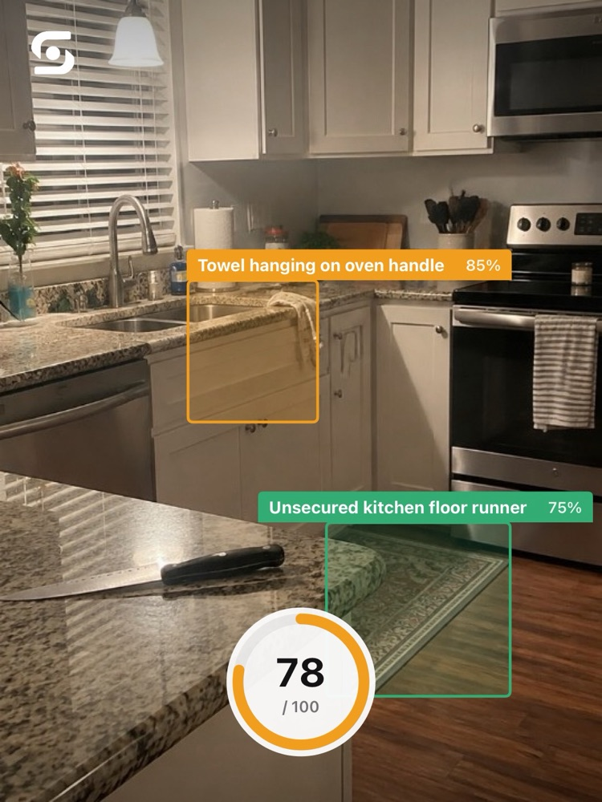
</p>

| Hazard | Severity | Confidence | Focus |
|--------|----------|------------|-------|
| Towel hanging on oven handle | Medium | 85% | Fire |
| Unsecured kitchen floor runner | Low | 75% | Trip hazards |

### Kitchen counter crop — 62/100

> Exposed knife on the island edge and a towel near the range pose immediate injury and fire risks.

<p align="center">
  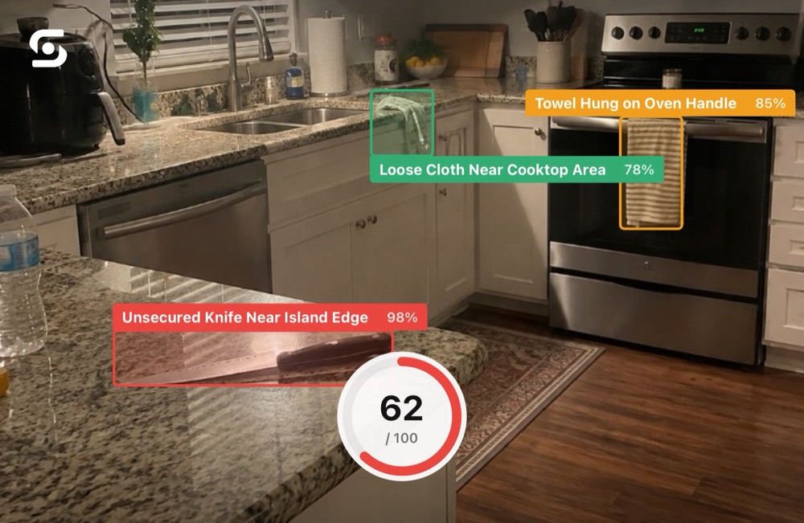
</p>

| Hazard | Severity | Confidence | Focus |
|--------|----------|------------|-------|
| Unsecured Knife Near Island Edge | High | 98% | Sharp objects |
| Towel Hung on Oven Handle | Medium | 85% | Kitchen hazards |
| Loose Cloth Near Cooktop Area | Low | 78% | Kitchen hazards |

### Kitchen floor crop — 62/100

> Exposed knife on the island edge presents a severe safety risk for children and pets.

<p align="center">
  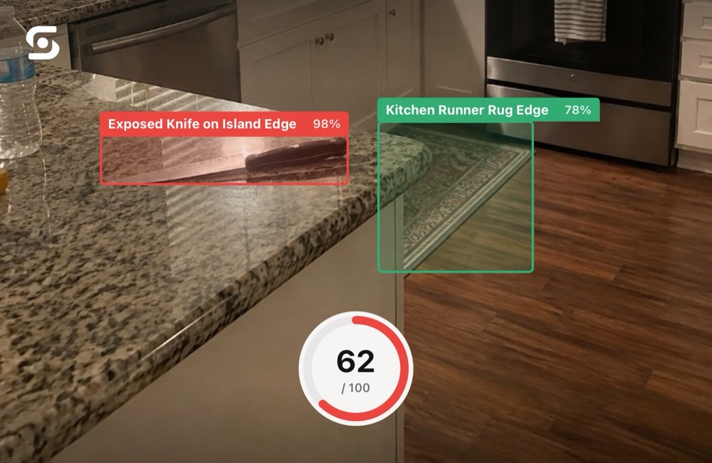
</p>

| Hazard | Severity | Confidence | Focus |
|--------|----------|------------|-------|
| Exposed Knife on Island Edge | High | 98% | Child proofing |
| Kitchen Runner Rug Edge | Low | 78% | Trip hazards |

### Kitchen oven crop — 68/100

> Exposed knife and items near stove create cut and fire hazards.

<p align="center">
  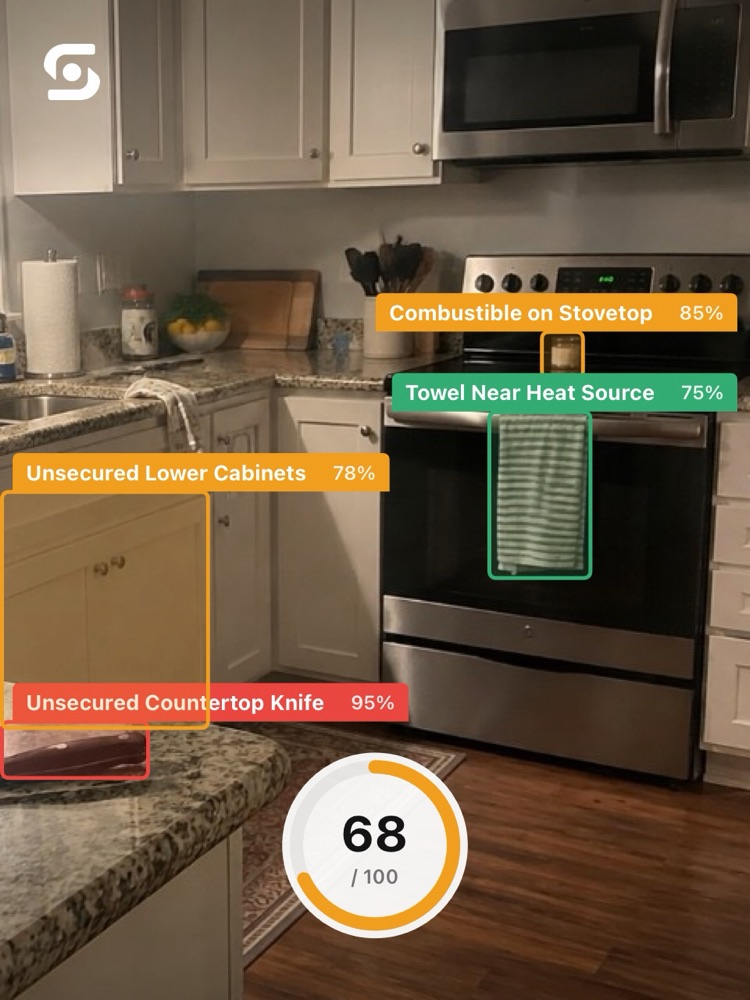
</p>

| Hazard | Severity | Confidence | Focus |
|--------|----------|------------|-------|
| Unsecured Countertop Knife | High | 95% | Child proofing |
| Combustible on Stovetop | Medium | 85% | Fire |
| Towel Near Heat Source | Low | 75% | Fire |
| Unsecured Lower Cabinets | Medium | 78% | Child proofing |

### Kitchen island crop — 62/100

> An exposed knife near the counter edge creates an immediate laceration hazard.

<p align="center">
  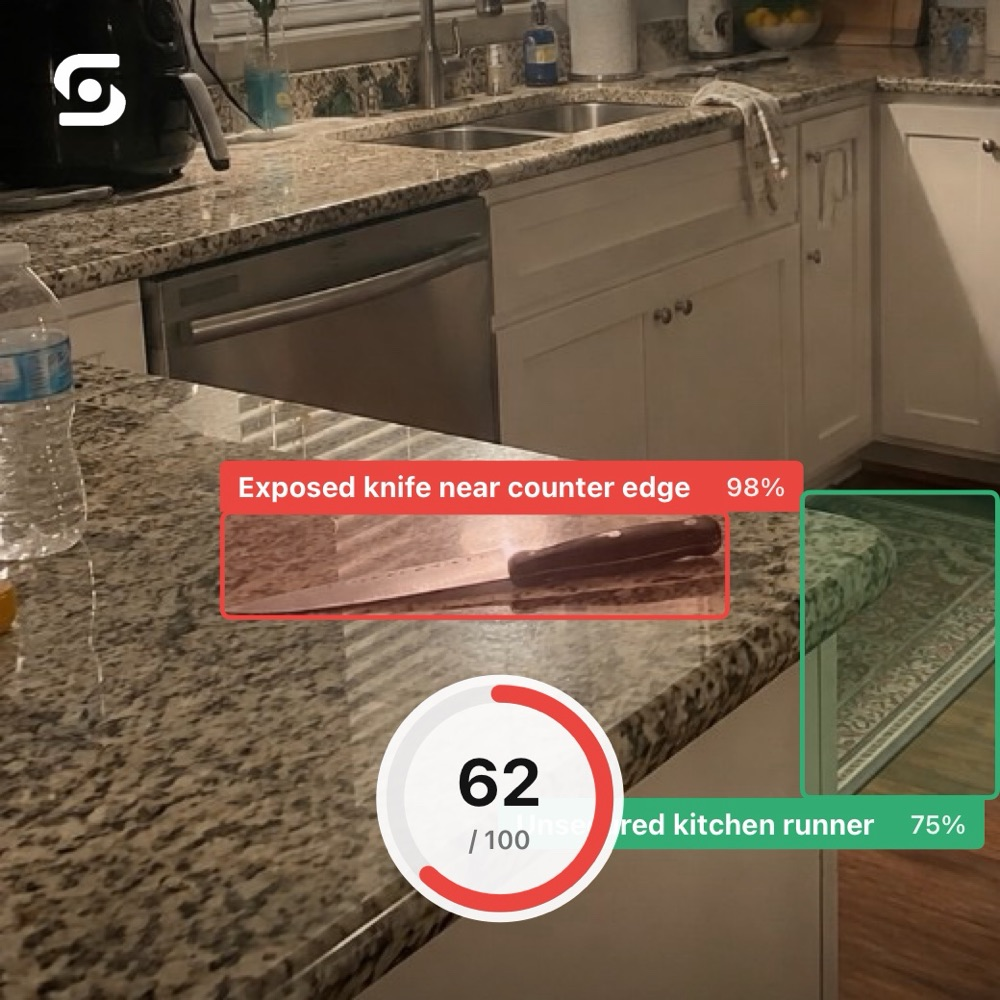
</p>

| Hazard | Severity | Confidence | Focus |
|--------|----------|------------|-------|
| Exposed knife near counter edge | High | 98% | Sharp objects |
| Unsecured kitchen runner | Low | 75% | Trip hazards |

### Living center crop — 82/100

> Living room is well kept with a few tip-over and tripping risks.

<p align="center">
  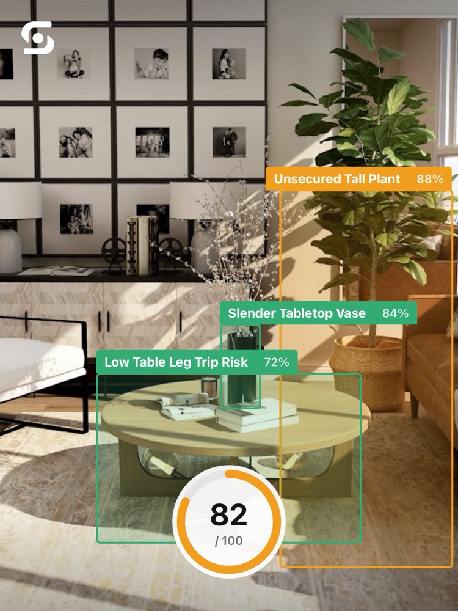
</p>

| Hazard | Severity | Confidence | Focus |
|--------|----------|------------|-------|
| Unsecured Tall Plant | Medium | 88% | Tip-over risks |
| Slender Tabletop Vase | Low | 84% | Tip-over risks |
| Low Table Leg Trip Risk | Low | 72% | Trip hazards |

### Living floor crop — 78/100

> Living space is mostly tidy but features breakable decor and accessible potted plant hazards.

<p align="center">
  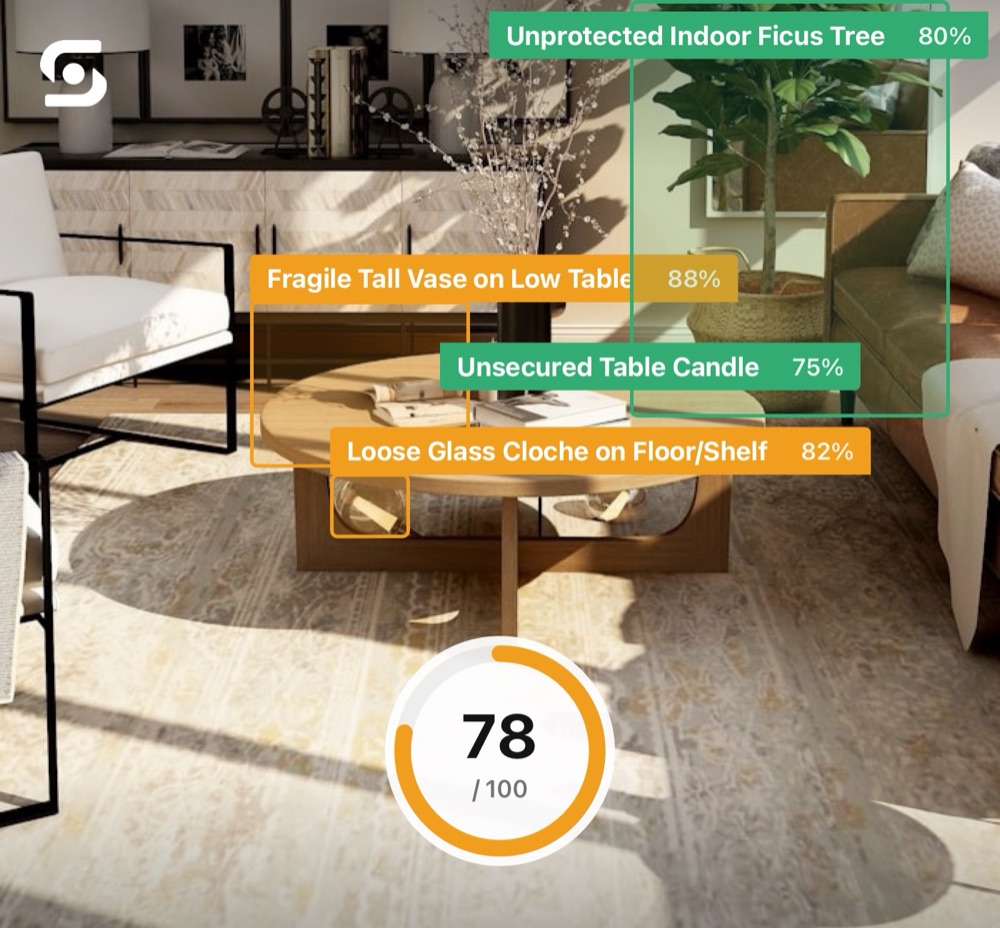
</p>

| Hazard | Severity | Confidence | Focus |
|--------|----------|------------|-------|
| Fragile Tall Vase on Low Table | Medium | 88% | Child proofing |
| Unprotected Indoor Ficus Tree | Low | 80% | Pet hazards |
| Loose Glass Cloche on Floor/Shelf | Medium | 82% | Child proofing |
| Unsecured Table Candle | Low | 75% | Child proofing |

### Living left crop — 85/100

> Living area is well-lit with potential tip hazards on the sideboard.

<p align="center">
  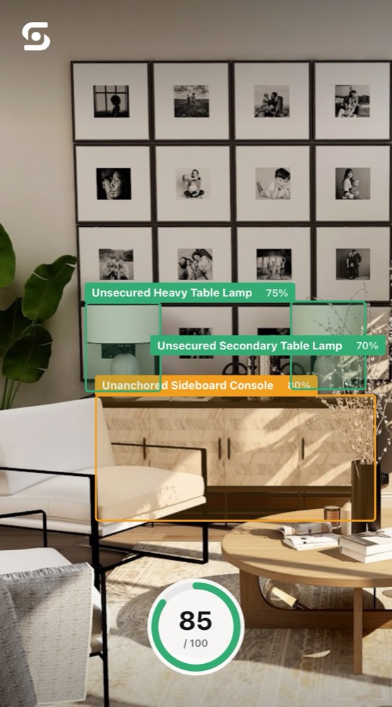
</p>

| Hazard | Severity | Confidence | Focus |
|--------|----------|------------|-------|
| Unanchored Sideboard Console | Medium | 80% | Tip-over risks |
| Unsecured Heavy Table Lamp | Low | 75% | Tip-over risks |
| Unsecured Secondary Table Lamp | Low | 70% | Tip-over risks |

### Living right crop — 88/100

> Living area is tidy with minimal hazards, though a tight walkway between table and sofa poses trip risks.

<p align="center">
  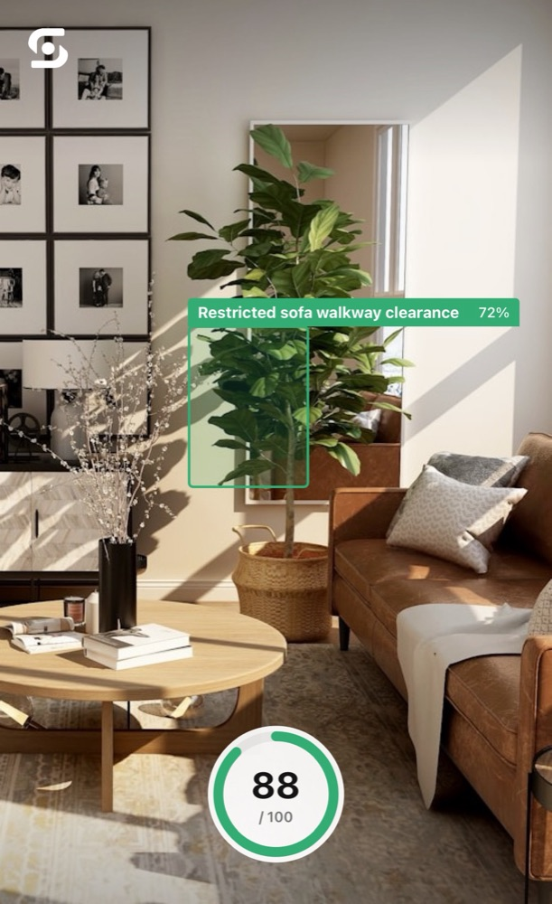
</p>

| Hazard | Severity | Confidence | Focus |
|--------|----------|------------|-------|
| Restricted sofa walkway clearance | Low | 72% | Trip hazards |

### Living wall crop — 82/100

> Potential furniture tip-over risks identified on the credenza and table lamp.

<p align="center">
  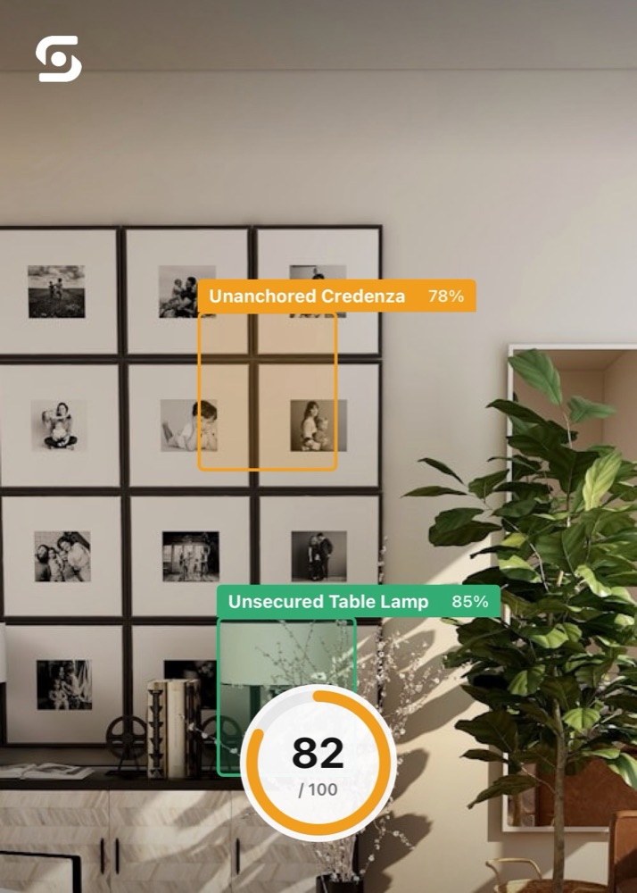
</p>

| Hazard | Severity | Confidence | Focus |
|--------|----------|------------|-------|
| Unanchored Credenza | Medium | 78% | Tip-over risks |
| Unsecured Table Lamp | Low | 85% | Tip-over risks |

### Stock island crop — 92/100

> Kitchen island is clean and tidy with minimal hazards detected.

<p align="center">
  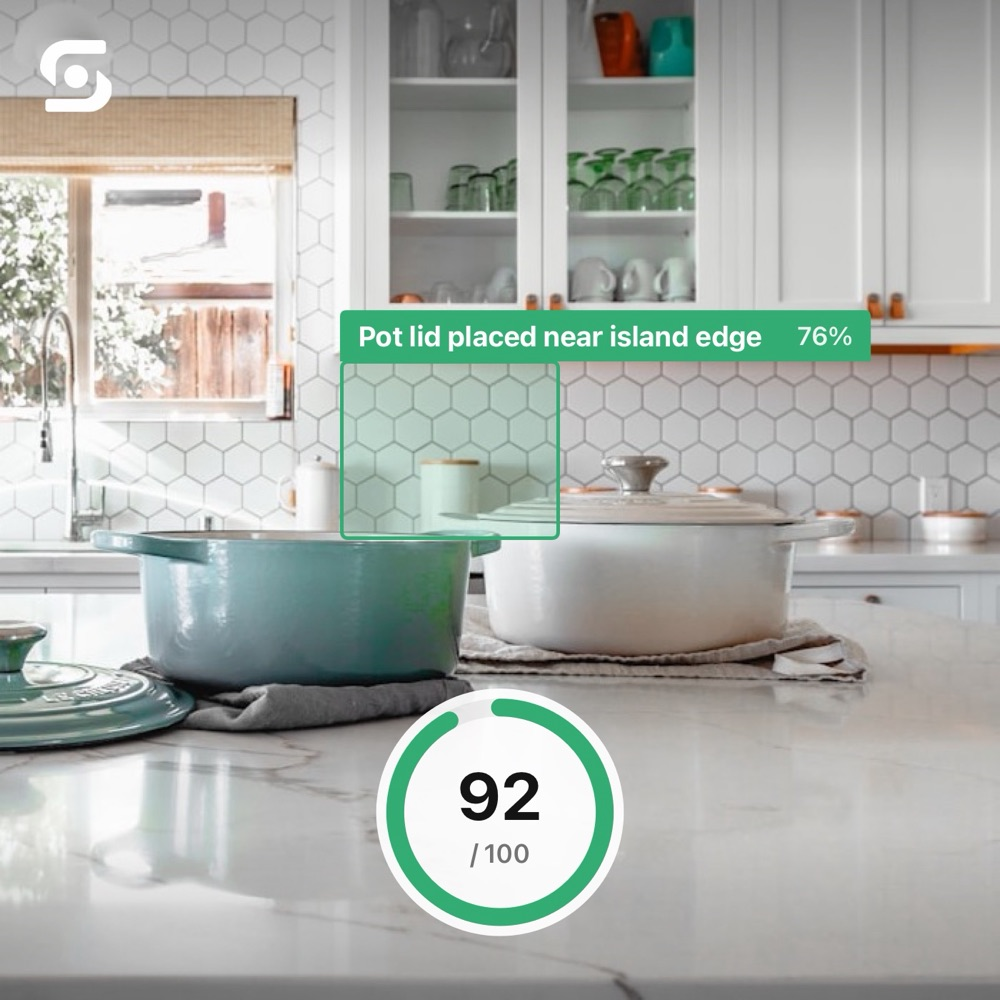
</p>

| Hazard | Severity | Confidence | Focus |
|--------|----------|------------|-------|
| Pot lid placed near island edge | Low | 76% | Kitchen hazards |

### Stock cookware crop — 78/100

> Heavy cookware sits near counter edge and cabinet glass lacks childproof latches.

<p align="center">
  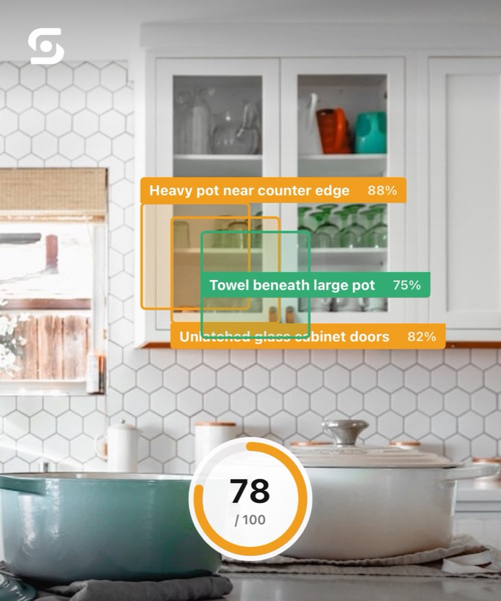
</p>

| Hazard | Severity | Confidence | Focus |
|--------|----------|------------|-------|
| Heavy pot near counter edge | Medium | 88% | Kitchen hazards |
| Unlatched glass cabinet doors | Medium | 82% | Child proofing |
| Towel beneath large pot | Low | 75% | Kitchen hazards |

### Stock floor crop — 78/100

> Heavy cookware sits near counter edges accessible to children or pets.

<p align="center">
  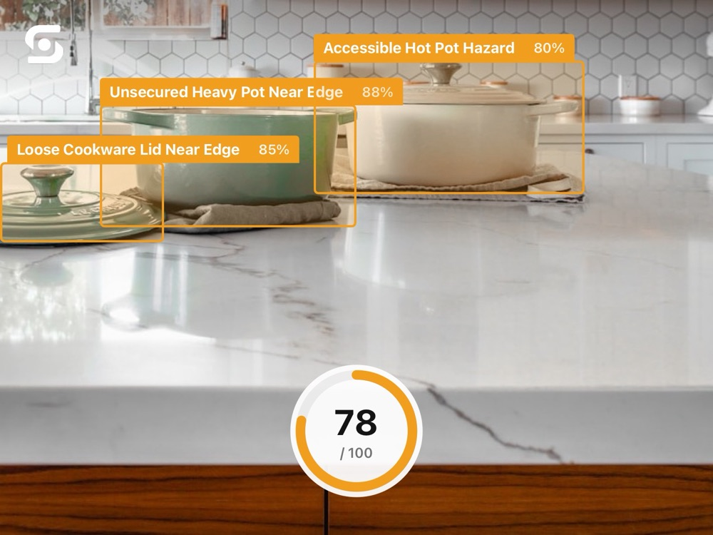
</p>

| Hazard | Severity | Confidence | Focus |
|--------|----------|------------|-------|
| Unsecured Heavy Pot Near Edge | Medium | 88% | Child proofing |
| Loose Cookware Lid Near Edge | Medium | 85% | Child proofing |
| Accessible Hot Pot Hazard | Medium | 80% | Pet hazards |

### Stock wide crop — 85/100

> Kitchen island holds heavy hot cookware placed near edge over cloths that could slip.

<p align="center">
  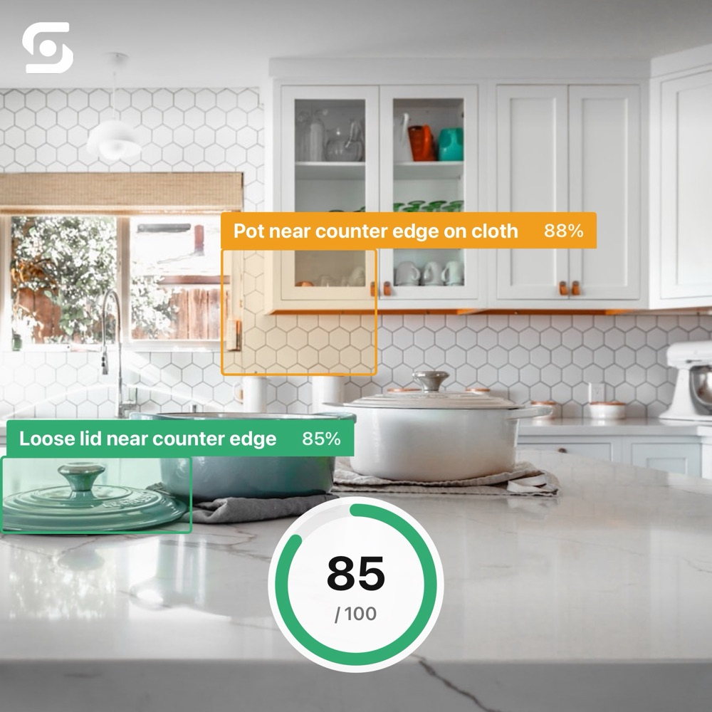
</p>

| Hazard | Severity | Confidence | Focus |
|--------|----------|------------|-------|
| Pot near counter edge on cloth | Medium | 88% | Kitchen hazards |
| Loose lid near counter edge | Low | 85% | Kitchen hazards |

### Kitchen upper crop — 74/100

> Kitchen has visible cutting hazards on the counter edge and items near the cooktop.

<p align="center">
  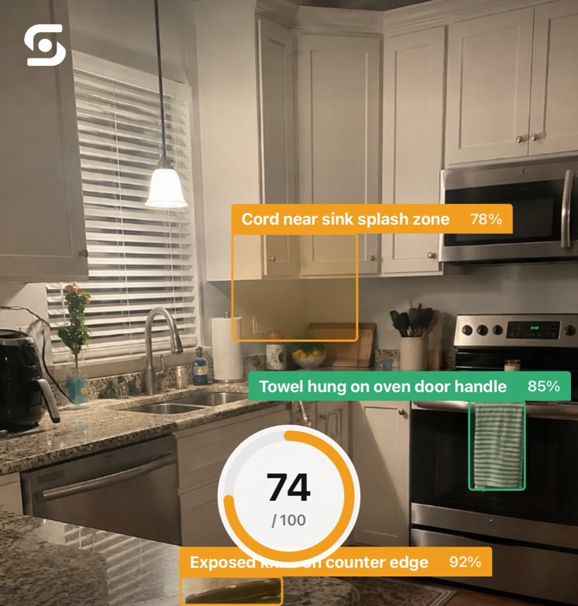
</p>

| Hazard | Severity | Confidence | Focus |
|--------|----------|------------|-------|
| Exposed knife on counter edge | Medium | 92% | Kitchen hazards |
| Towel hung on oven door handle | Low | 85% | Fire |
| Cord near sink splash zone | Medium | 78% | Electric |

### Living close crop — 68/100

> Visible tip risks from unanchored tall items and fragile objects within toddler reach.

<p align="center">
  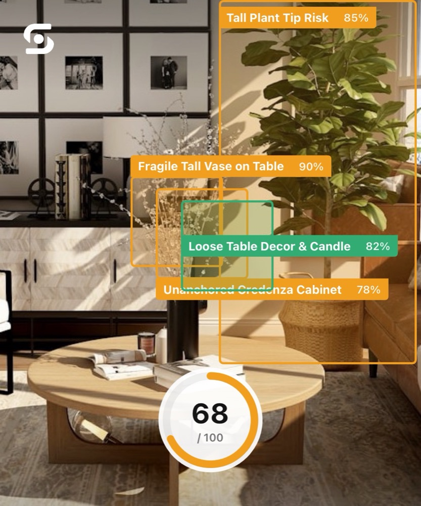
</p>

| Hazard | Severity | Confidence | Focus |
|--------|----------|------------|-------|
| Tall Plant Tip Risk | Medium | 85% | Tip-over risks |
| Fragile Tall Vase on Table | Medium | 90% | Child proofing |
| Unanchored Credenza Cabinet | Medium | 78% | Tip-over risks |
| Loose Table Decor & Candle | Low | 82% | Child proofing |

### Stock corner crop — 85/100

> Kitchen is clean and orderly with minimal visible hazards, mainly potential burn or slip risks.

<p align="center">
  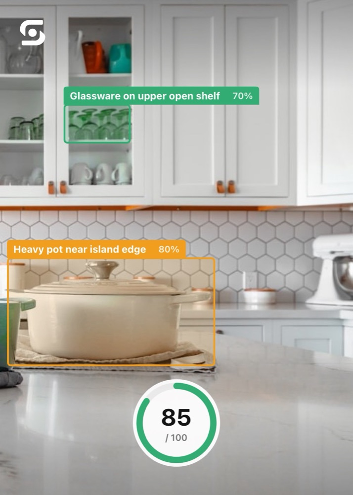
</p>

| Hazard | Severity | Confidence | Focus |
|--------|----------|------------|-------|
| Heavy pot near island edge | Medium | 80% | Kitchen hazards |
| Glassware on upper open shelf | Low | 70% | Kitchen hazards |

## How to re-run

```bash
# Requires Safesight/SafesightAPISecrets.plist (gitignored) with API_SECRET
python3 scripts/run_benchmark.py
python3 scripts/validate_benchmark.py
```

Sources live in `docs/benchmark/sources/` (full frames + crops of real room photos).

[← Back to README](../README.md)
