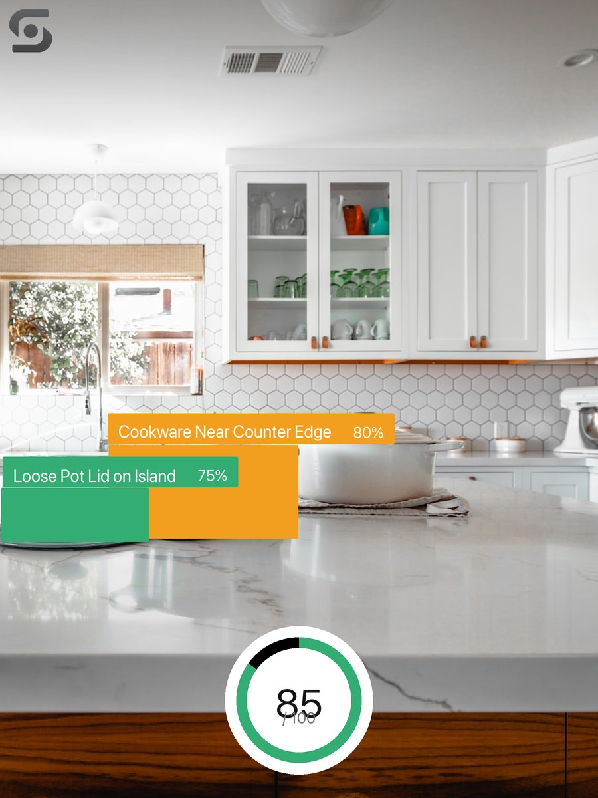

# AI benchmark

Live proof that Safesight’s hosted vision pipeline returns real House Scores,
hazard labels, confidences, and bounding boxes — then renders the **same share card**
chrome the iOS app exports (`ScanShareExporter`).

- **Ran:** `2026-09-11 02:05:25Z`
- **API:** `https://safesight.noahwhiteson.com`
- **Model:** `gemini-3.8-flash` (from `/health`)
- **Result:** **3/3 passed**

## Cases

| Scene | HTTP | Latency | House Score | Hazards |
|-------|------|---------|-------------|---------|
| ✅ Kitchen | 200 | 3.14s | 68 | 3 |
| ✅ Hallway | 200 | 3.8s | 82 | 2 |
| ✅ Kitchen (stock) | 200 | 2.98s | 85 | 2 |

## Share cards (app export UI)

### Kitchen — 68/100

> Exposed knife and an unanchored floor runner present clear kitchen hazards.

<p align="center">
  
</p>

| Hazard | Severity | Confidence |
|--------|----------|------------|
| Exposed Knife on Counter | High | 98% |
| Loose Floor Runner | Medium | 85% |
| Towel on Oven Handle | Low | 75% |

### Hallway — 82/100

> Living space is tidy but tight clearances and loose rug perimeters present minor trip hazards.

<p align="center">
  
</p>

| Hazard | Severity | Confidence |
|--------|----------|------------|
| Low clearance around coffee table | Medium | 85% |
| Potential rug edge curl | Low | 75% |

### Kitchen (stock) — 85/100

> Heavy cookware sits resting on soft cloth near the counter edge.

<p align="center">
  
</p>

| Hazard | Severity | Confidence |
|--------|----------|------------|
| Cookware Near Counter Edge | Medium | 80% |
| Loose Pot Lid on Island | Low | 75% |

## How to re-run

```bash
# Requires Safesight/SafesightAPISecrets.plist (gitignored) with API_SECRET
python3 scripts/run_benchmark.py
```

Raw JSON for each case is committed beside the share cards for auditability.

[← Back to README](../README.md)
