# AI benchmark

Live proof on **20 distinct room photos** (unique files — not crops of one scene).
Share cards are the exact iOS `ScanShareExporter` output.

- **Ran:** `2026-09-11 02:36:29Z`
- **API:** `https://safesight.noahwhiteson.com`
- **Model:** `gemini-3.8-flash`
- **Result:** **20/20 passed**

## Cases

| # | Scene | HTTP | Latency | Score | Hazards | Check |
|---|-------|------|---------|-------|---------|-------|
| 1 | ✅ Kitchen (user) | 200 | 5.39s | 68 | 4 | ok |
| 2 | ✅ Living / hallway | 200 | 4.11s | 82 | 3 | ok |
| 3 | ✅ Kitchen (stock) | 200 | 8.59s | 88 | 2 | ok |
| 4 | ✅ Bathroom | 200 | 3.95s | 78 | 3 | ok |
| 5 | ✅ Bedroom | 200 | 3.51s | 86 | 3 | ok |
| 6 | ✅ Living (sofa) | 200 | 3.34s | 78 | 3 | ok |
| 7 | ✅ Kitchen (white) | 200 | 2.84s | 82 | 2 | ok |
| 8 | ✅ Bedroom (boho) | 200 | 2.98s | 82 | 2 | ok |
| 9 | ✅ Laundry room | 200 | 3.75s | 88 | 2 | ok |
| 10 | ✅ Living (windows) | 200 | 2.71s | 88 | 2 | ok |
| 11 | ✅ Dining room | 200 | 3.7s | 78 | 4 | ok |
| 12 | ✅ Living (modern) | 200 | 3.49s | 78 | 4 | ok |
| 13 | ✅ Living + stairs | 200 | 3.4s | 62 | 3 | ok |
| 14 | ✅ Kitchen (cooking) | 200 | 3.16s | 68 | 3 | ok |
| 15 | ✅ Home office | 200 | 2.64s | 88 | 2 | ok |
| 16 | ✅ Bathroom (modern) | 200 | 3.3s | 82 | 3 | ok |
| 17 | ✅ Closet / wardrobe | 200 | 3.87s | 62 | 4 | ok |
| 18 | ✅ Kitchen (island) | 200 | 2.47s | 86 | 1 | ok |
| 19 | ✅ Open plan + patio | 200 | 3.34s | 88 | 3 | ok |
| 20 | ✅ Garage | 200 | 3.72s | 68 | 3 | ok |

## Share cards (native `ScanShareExporter`)

### Kitchen (user) — 68/100

> Exposed knife on the island edge and a runner rug without non-slip backing create injury and trip risks.

<p align="center">
  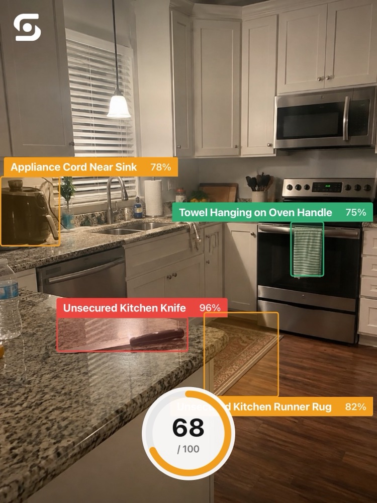
</p>

| Hazard | Severity | Confidence | Focus |
|--------|----------|------------|-------|
| Unsecured Chef Knife on Counter | High | 98% | Sharp objects |
| Curled Kitchen Runner Rug | Medium | 88% | Trip hazards |
| Towel Hanging on Oven Handle | Low | 82% | Fire |
| Combustible Paper Near Sink and Cook | Low | 74% | Kitchen hazards |

### Living / hallway — 82/100

> Living room is well kept, but unanchored tall items present tip-over and path hazards.

<p align="center">
  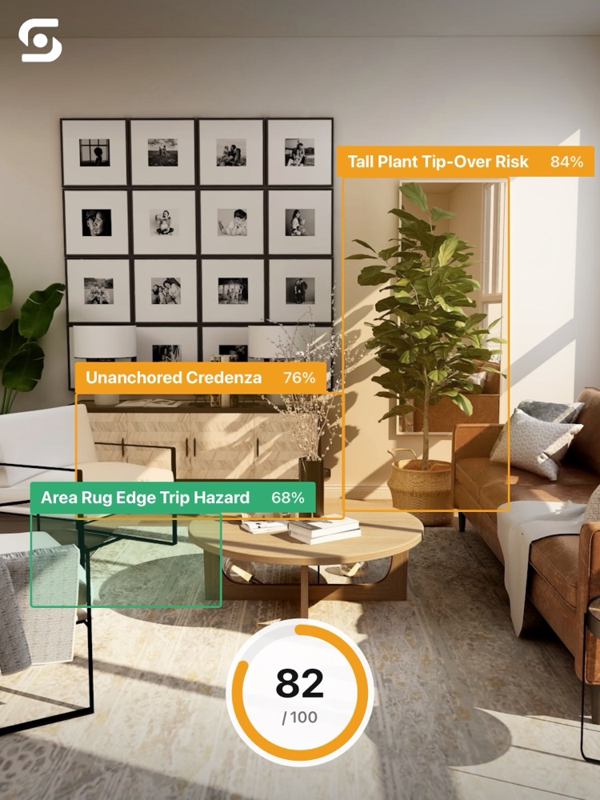
</p>

| Hazard | Severity | Confidence | Focus |
|--------|----------|------------|-------|
| Tall Plant Tip-Over Risk | Medium | 84% | Tip-over risks |
| Unanchored Credenza | Medium | 76% | Tip-over risks |
| Area Rug Edge Trip Hazard | Low | 68% | Trip hazards |

### Kitchen (stock) — 88/100

> Clean kitchen space with minor risks from heavy cookware placed near the island edge.

<p align="center">
  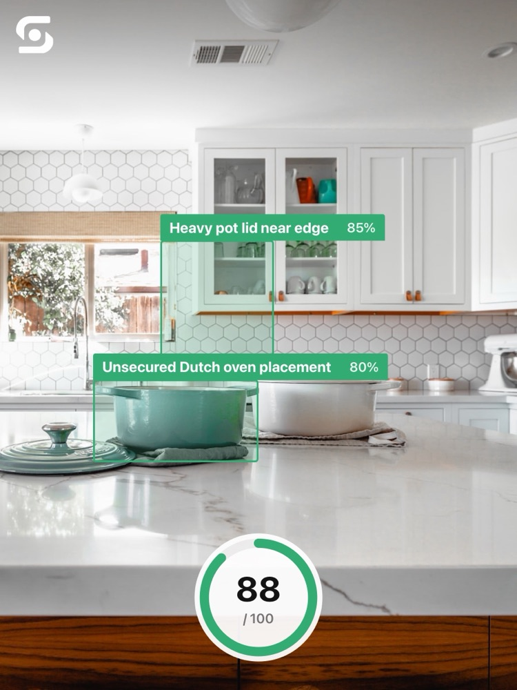
</p>

| Hazard | Severity | Confidence | Focus |
|--------|----------|------------|-------|
| Heavy pot lid near edge | Low | 85% | Kitchen hazards |
| Unsecured Dutch oven placement | Low | 80% | Kitchen hazards |

### Bathroom — 78/100

> Bathroom is generally tidy, but a stool and accessible cabinet pose minor safety risks.

<p align="center">
  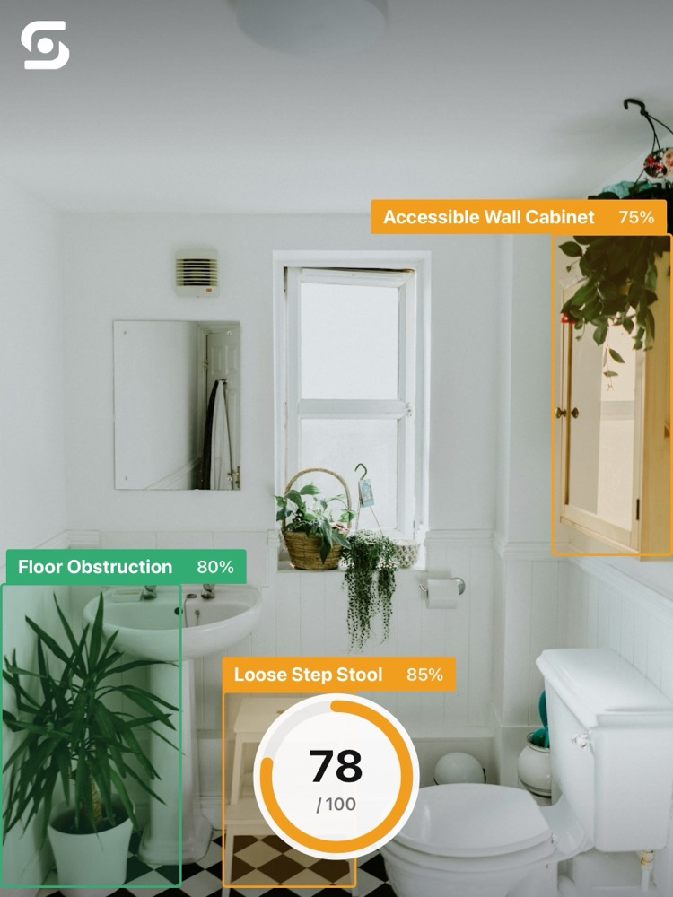
</p>

| Hazard | Severity | Confidence | Focus |
|--------|----------|------------|-------|
| Loose Step Stool | Medium | 85% | Child proofing |
| Floor Obstruction | Low | 80% | Trip hazards |
| Accessible Wall Cabinet | Medium | 75% | Child proofing |

### Bedroom — 86/100

> The bedroom is well kept, but exposed hot bulbs and top-heavy accents pose minor hazards.

<p align="center">
  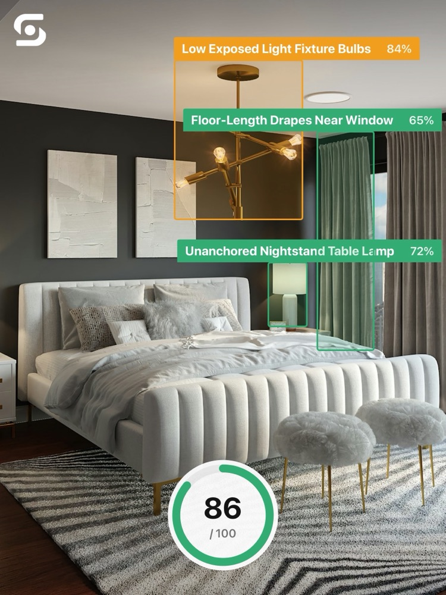
</p>

| Hazard | Severity | Confidence | Focus |
|--------|----------|------------|-------|
| Low Exposed Light Fixture Bulbs | Medium | 84% | Fire |
| Unanchored Nightstand Table Lamp | Low | 72% | Tip-over risks |
| Floor-Length Drapes Near Window | Low | 65% | Windows & falls |

### Living (sofa) — 78/100

> Tall floor lamp and slender accent table present minor tip-over risks in the living space.

<p align="center">
  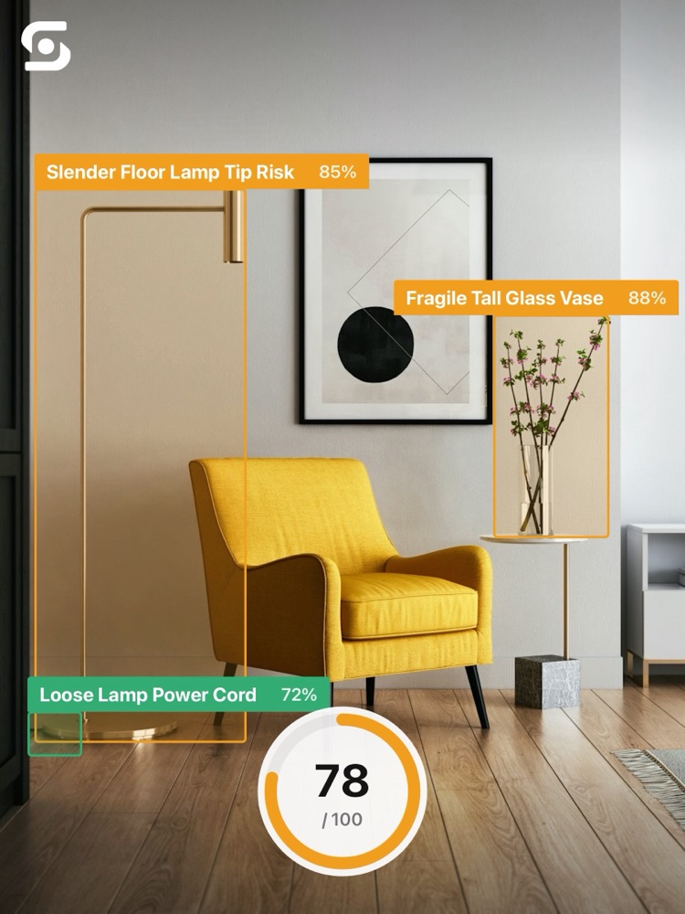
</p>

| Hazard | Severity | Confidence | Focus |
|--------|----------|------------|-------|
| Slender Floor Lamp Tip Risk | Medium | 85% | Tip-over risks |
| Fragile Tall Glass Vase | Medium | 88% | Pet hazards |
| Loose Lamp Power Cord | Low | 72% | Trip hazards |

### Kitchen (white) — 82/100

> Overall tidy kitchen with minor fire hazard and floor rug tripping risk.

<p align="center">
  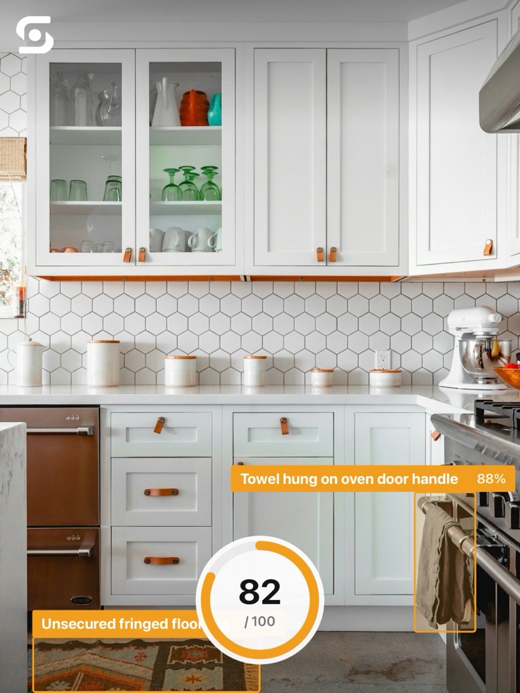
</p>

| Hazard | Severity | Confidence | Focus |
|--------|----------|------------|-------|
| Towel hung on oven door handle | Medium | 88% | Fire |
| Unsecured fringed floor rug | Medium | 92% | Trip hazards |

### Bedroom (boho) — 82/100

> Bedroom shows potential candle fire risk near foliage and an exposed bedside cord.

<p align="center">
  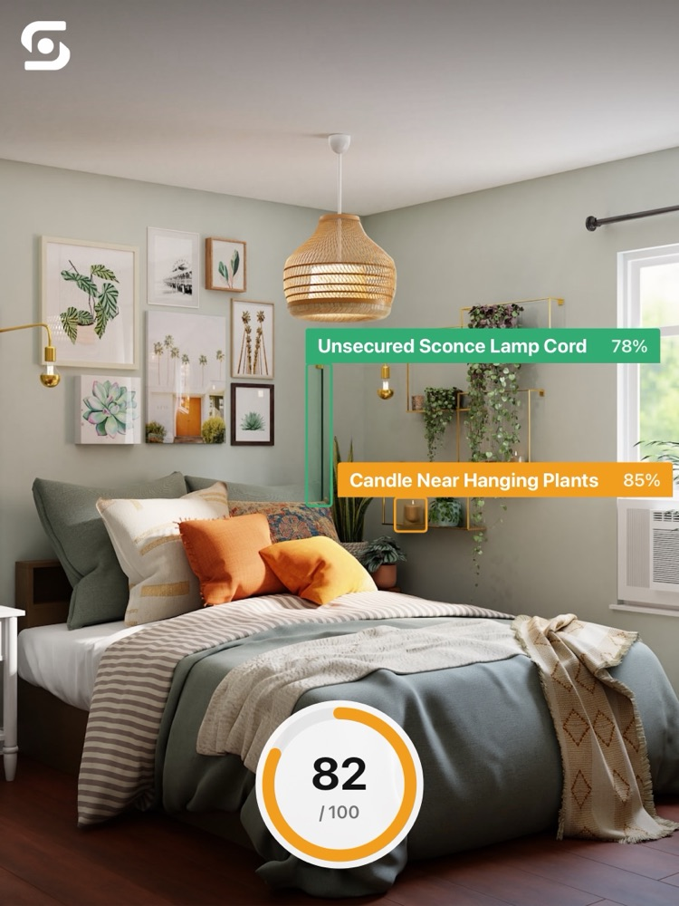
</p>

| Hazard | Severity | Confidence | Focus |
|--------|----------|------------|-------|
| Candle Near Hanging Plants | Medium | 85% | Fire |
| Unsecured Sconce Lamp Cord | Low | 78% | Electric |

### Laundry room — 88/100

> Chemical detergent handling presents spill, contact, and ingestion risks if left unsecured.

<p align="center">
  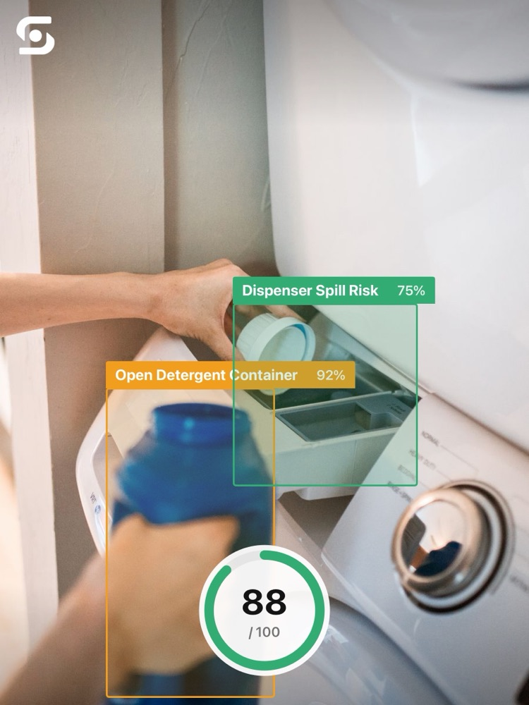
</p>

| Hazard | Severity | Confidence | Focus |
|--------|----------|------------|-------|
| Open Detergent Container | Medium | 92% | Chemical storage |
| Dispenser Spill Risk | Low | 75% | Chemical storage |

### Living (windows) — 88/100

> Dining space is clean with minimal hazards, though curtain drape length presents a slight trip risk.

<p align="center">
  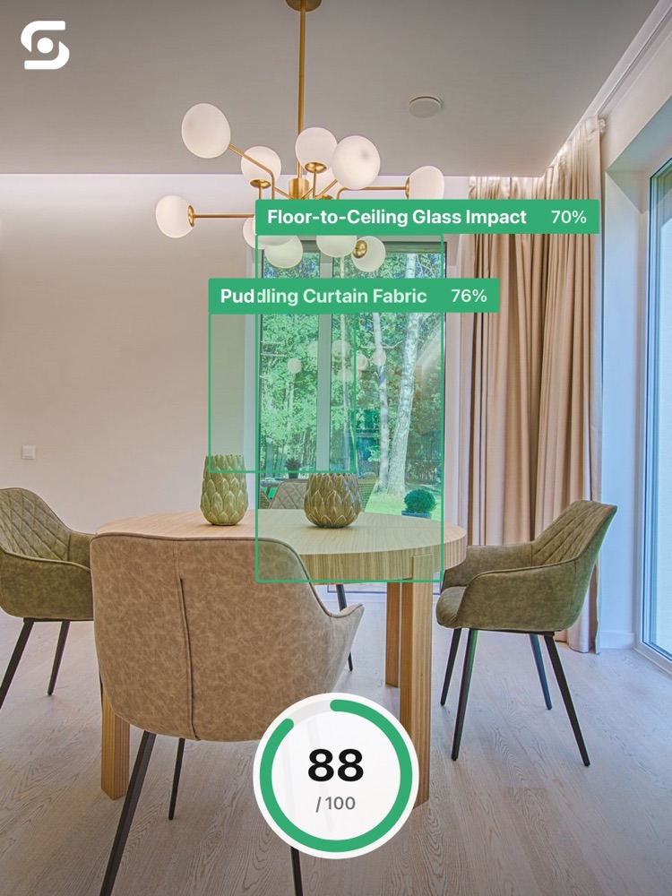
</p>

| Hazard | Severity | Confidence | Focus |
|--------|----------|------------|-------|
| Puddling Curtain Fabric | Low | 76% | Trip hazards |
| Floor-to-Ceiling Glass Impact | Low | 70% | Windows & falls |

### Dining room — 78/100

> Dining space presents minor breakable glass and potential sharp edge risks for children.

<p align="center">
  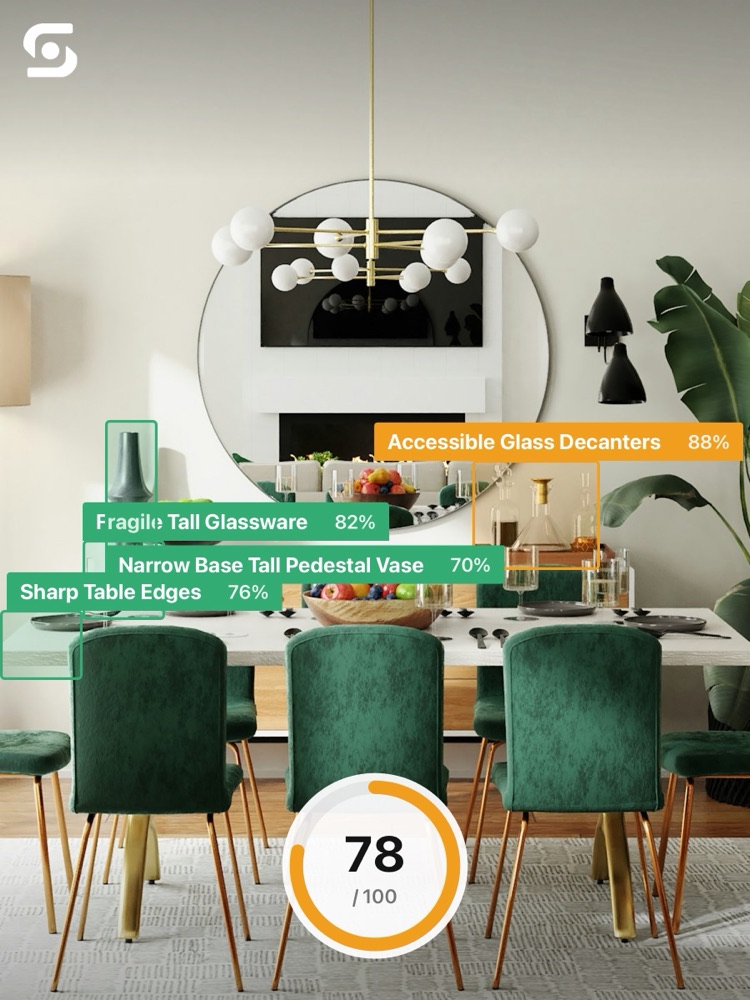
</p>

| Hazard | Severity | Confidence | Focus |
|--------|----------|------------|-------|
| Accessible Glass Decanters | Medium | 88% | Child proofing |
| Fragile Tall Glassware | Low | 82% | Sharp objects |
| Sharp Table Edges | Low | 76% | Child proofing |
| Narrow Base Tall Pedestal Vase | Low | 70% | Tip-over risks |

### Living (modern) — 78/100

> Living space is tidy but has minor tip-over, toxic plant, and ottoman trip hazards.

<p align="center">
  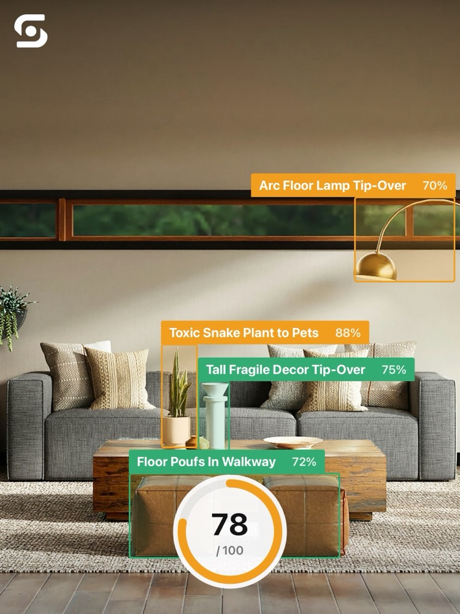
</p>

| Hazard | Severity | Confidence | Focus |
|--------|----------|------------|-------|
| Toxic Snake Plant to Pets | Medium | 88% | Pet hazards |
| Tall Fragile Decor Tip-Over | Low | 75% | Tip-over risks |
| Floor Poufs In Walkway | Low | 72% | Trip hazards |
| Arc Floor Lamp Tip-Over | Medium | 70% | Tip-over risks |

### Living + stairs — 62/100

> Floating stairs lack handrails and the transparent balustrade creates fall and collision risks.

<p align="center">
  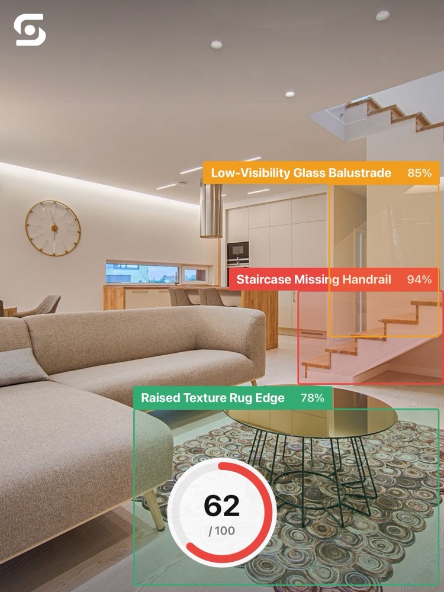
</p>

| Hazard | Severity | Confidence | Focus |
|--------|----------|------------|-------|
| Staircase Missing Handrail | High | 94% | Stairs & falls |
| Low-Visibility Glass Balustrade | Medium | 85% | Child proofing |
| Raised Texture Rug Edge | Low | 78% | Trip hazards |

### Kitchen (cooking) — 68/100

> Stove-edge cookpot placement and reach-across scraping create burn and scald risks.

<p align="center">
  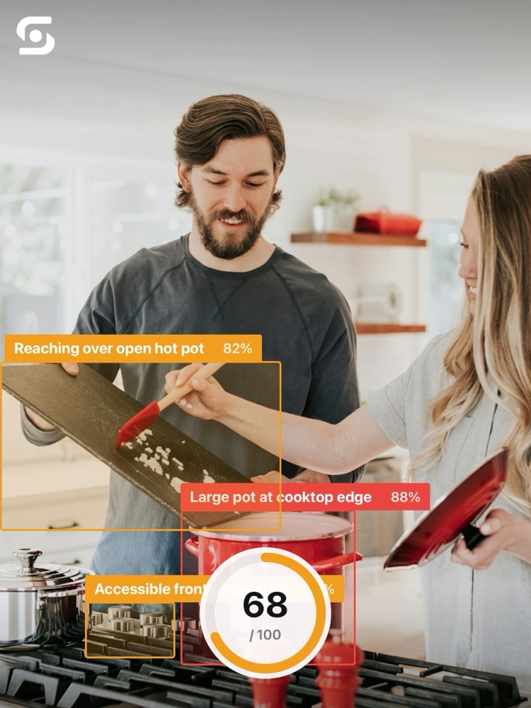
</p>

| Hazard | Severity | Confidence | Focus |
|--------|----------|------------|-------|
| Large pot at cooktop edge | High | 88% | Kitchen hazards |
| Reaching over open hot pot | Medium | 82% | Kitchen hazards |
| Accessible front range dials | Medium | 75% | Child proofing |

### Home office — 88/100

> Workspace is well-organized with minimal hazards, noting an exposed electrical cord near baseboard.

<p align="center">
  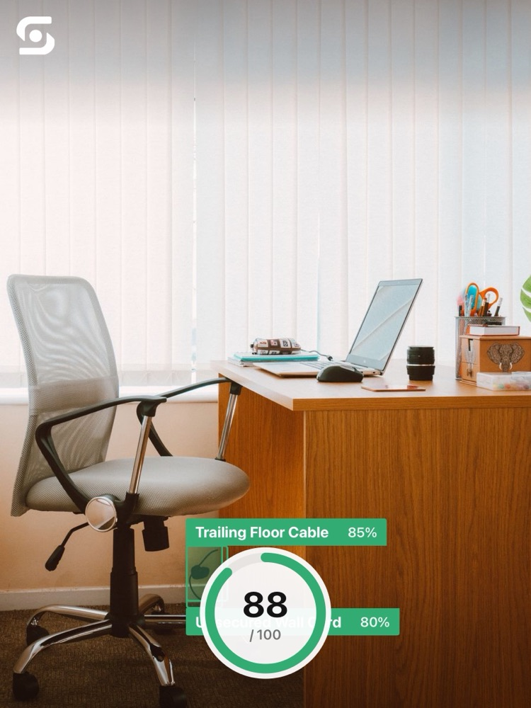
</p>

| Hazard | Severity | Confidence | Focus |
|--------|----------|------------|-------|
| Trailing Floor Cable | Low | 85% | Trip hazards |
| Unsecured Wall Cord | Low | 80% | Electric |

### Bathroom (modern) — 82/100

> Bathroom is clean and modern, but loose mat and sharp vanity edges pose slip and impact hazards.

<p align="center">
  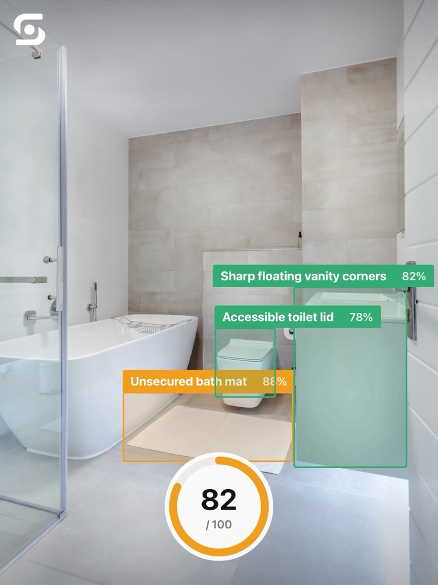
</p>

| Hazard | Severity | Confidence | Focus |
|--------|----------|------------|-------|
| Unsecured bath mat | Medium | 88% | Trip hazards |
| Sharp floating vanity corners | Low | 82% | Child proofing |
| Accessible toilet lid | Low | 78% | Child proofing |

### Closet / wardrobe — 62/100

> Tall unanchored furniture and exposed low-level wall sockets present tip-over and child safety risks.

<p align="center">
  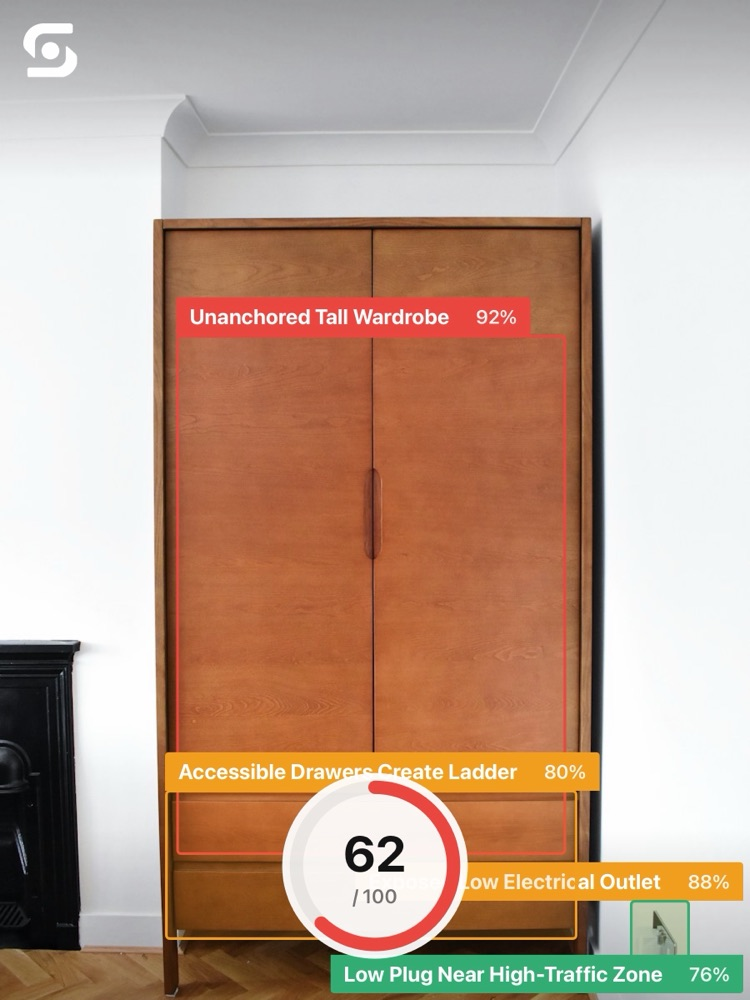
</p>

| Hazard | Severity | Confidence | Focus |
|--------|----------|------------|-------|
| Unanchored Tall Wardrobe | High | 92% | Tip-over risks |
| Exposed Low Electrical Outlet | Medium | 88% | Child proofing |
| Accessible Drawers Create Ladder | Medium | 80% | Child proofing |
| Low Plug Near High-Traffic Zone | Low | 76% | Electric |

### Kitchen (island) — 86/100

> Overall kitchen is tidy, but loose floor matting poses a tripping risk.

<p align="center">
  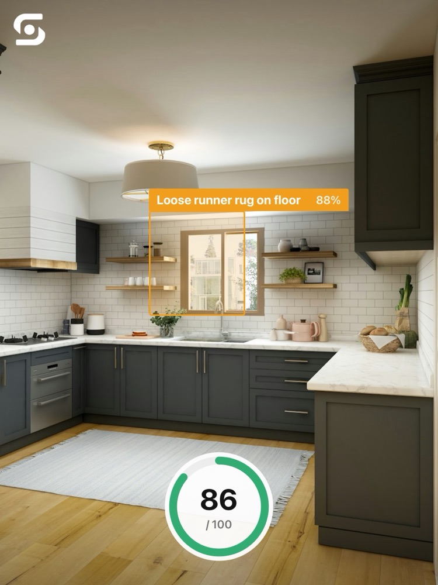
</p>

| Hazard | Severity | Confidence | Focus |
|--------|----------|------------|-------|
| Loose runner rug on floor | Medium | 88% | Trip hazards |

### Open plan + patio — 88/100

> Living area is tidy with minor tip-over and impact risks from low accent tables.

<p align="center">
  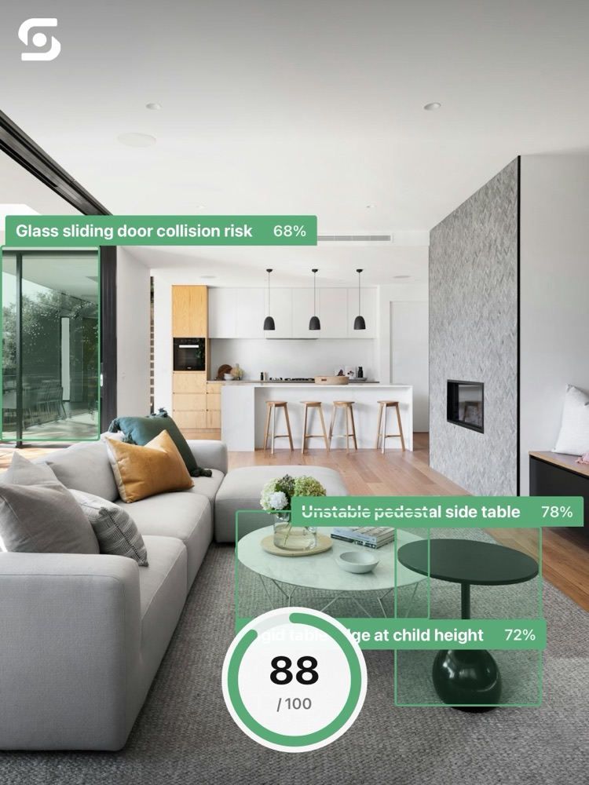
</p>

| Hazard | Severity | Confidence | Focus |
|--------|----------|------------|-------|
| Unstable pedestal side table | Low | 78% | Child proofing |
| Rigid table edge at child height | Low | 72% | Child proofing |
| Glass sliding door collision risk | Low | 68% | Windows & falls |

### Garage — 68/100

> Multiple uncontained chemicals and automotive fluids stored openly in work zone.

<p align="center">
  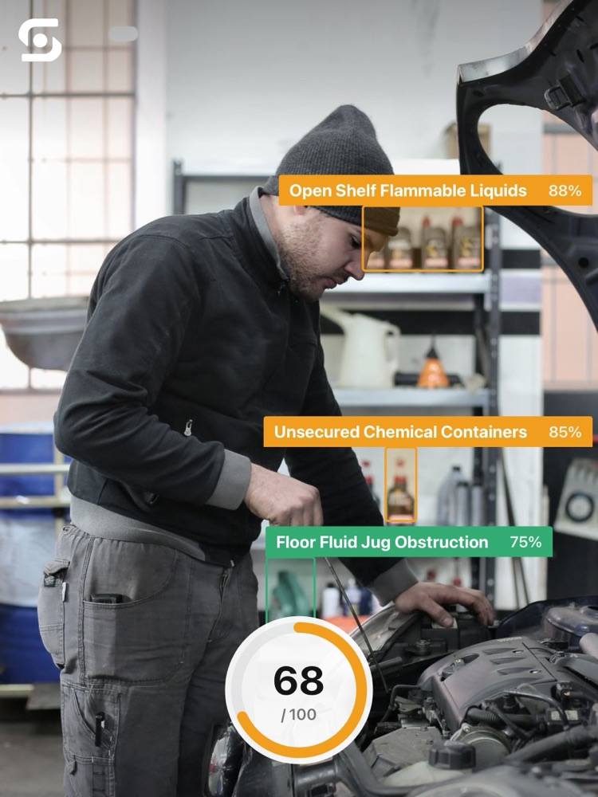
</p>

| Hazard | Severity | Confidence | Focus |
|--------|----------|------------|-------|
| Open Shelf Flammable Liquids | Medium | 88% | Fire |
| Unsecured Chemical Containers | Medium | 85% | Chemical storage |
| Floor Fluid Jug Obstruction | Low | 75% | Trip hazards |

## How to re-run

```bash
python3 scripts/run_benchmark.py
python3 scripts/validate_benchmark.py
```

Sources: `docs/benchmark/sources/` (20 unique photos).

[← Back to README](../README.md)
