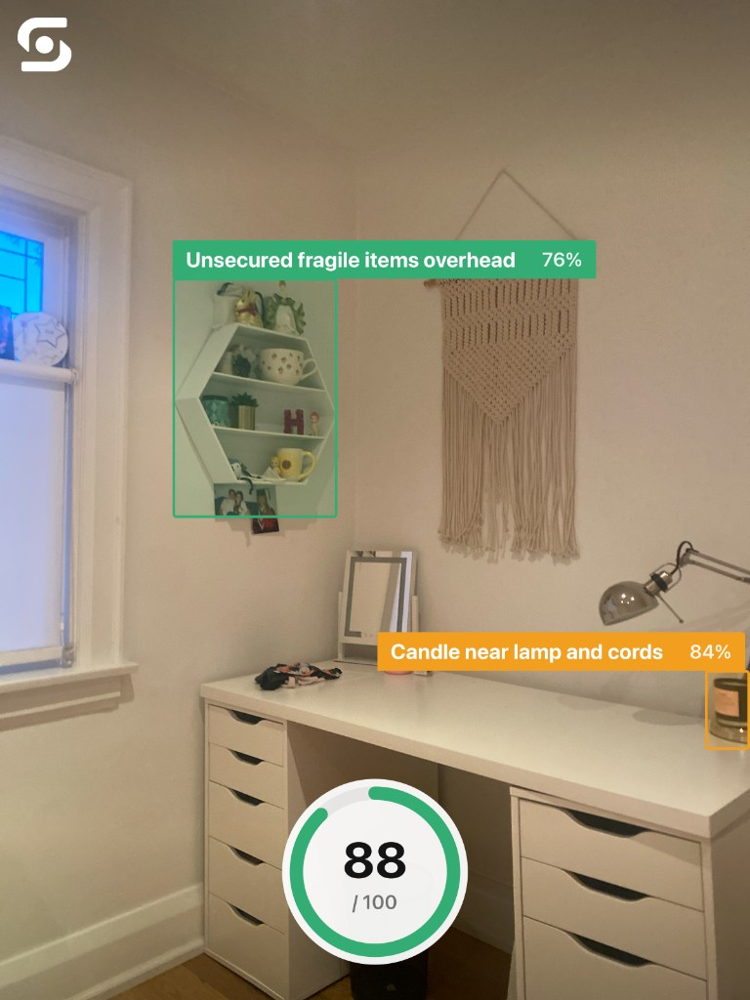
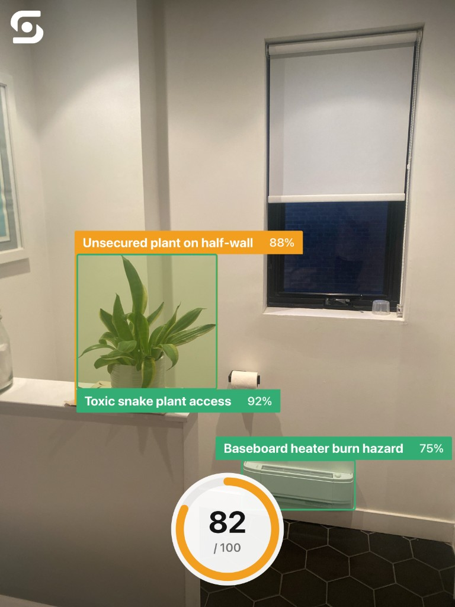
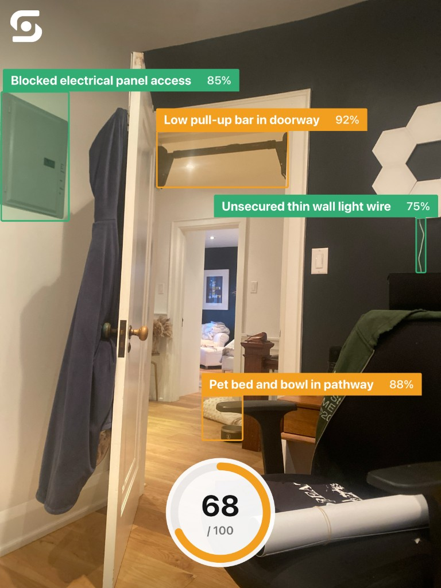
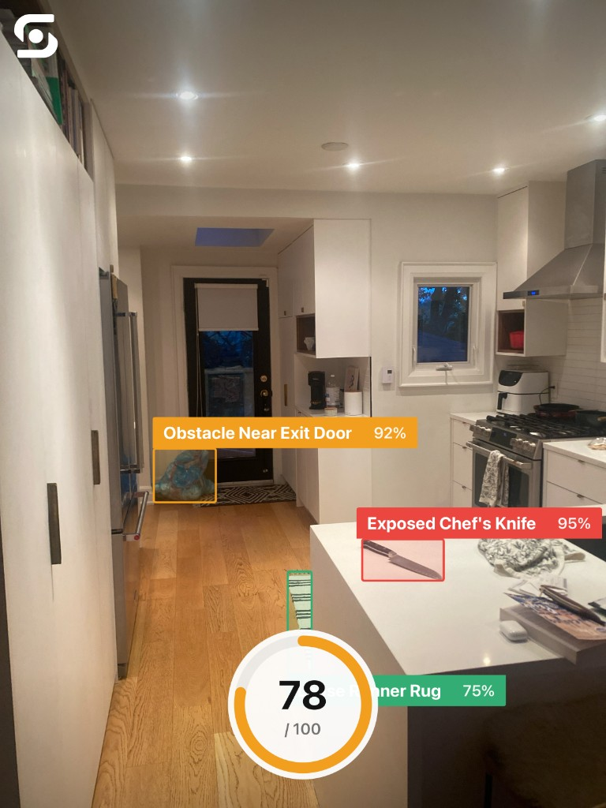

# Safesight in real rooms

Real scans from the app — boxes on the photo, confidence on each label, House Score on the share card.

  
  &nbsp;
  

  Desk · 88/100 &nbsp;·&nbsp; Bathroom · 82/100

  
  &nbsp;
  

  Hallway · 68/100 &nbsp;·&nbsp; Kitchen · 78/100

[← Back to README](../README.md)
